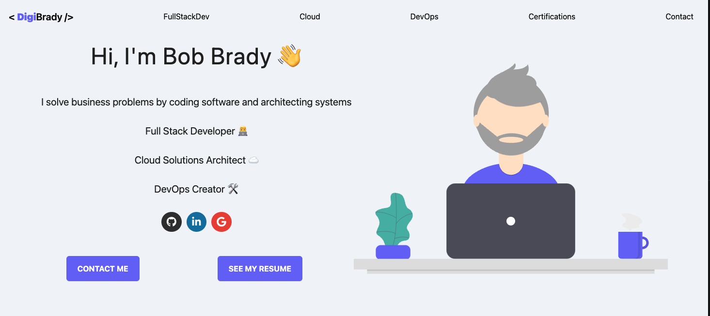
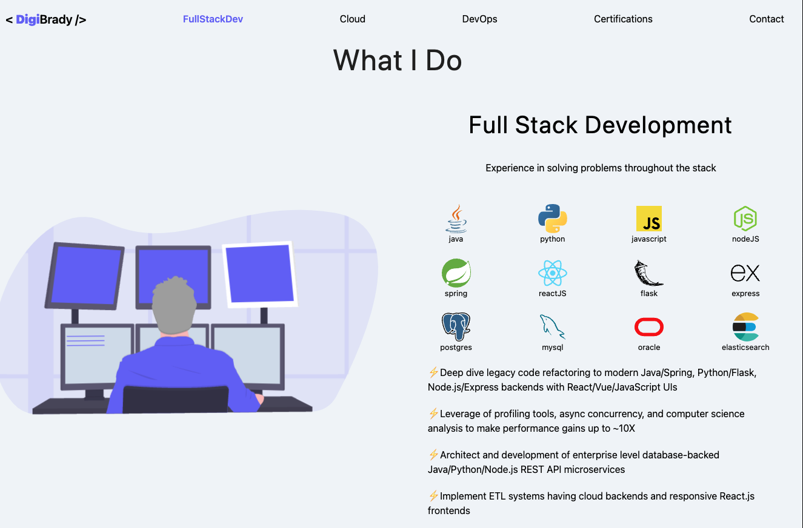

# Developer React Portfolio Website

A simple React portfolio website suitable for software engineers and IT staff. This project has the following features:

- Simple "vanilla" React.js
- Bootstrapped with [Create React App](https://github.com/facebook/create-react-app) using latest version of React, v18
- Modern CSS using Flexbox and Grid for layout
- Responsive, mobile-first design
- Tested with mobile devices
- Simple React hooks for managing Hamburger menu and scrolling to sections.
- Data JS file feeds React component content

## Example Content

**About Section**

**Sample Skills Section**

**Certifications and Contact**

## Usage

In the project directory, you can run:

### `npm start`

Runs the app in the development mode.\
Open [http://localhost:3000](http://localhost:3000) to view it in your browser.

The page will reload when you make changes.\
You may also see any lint errors in the console.

### `npm run build`

Builds the app for production to the `build` folder.\
It correctly bundles React in production mode and optimizes the build for the best performance.

The build is minified and the filenames include the hashes.\
Your app is ready to be deployed!
